<div class="flex items-baseline justify-between mb-2">
  <h1 class="text-2xl font-light tracking-tight">A cookbook for a weather station — Part I</h1>
  <time class="text-sm text-gray-600 ml-4">September 1, 2025</time>
</div>

Have you ever wondered how to measure **temperature** and **humidity**?

I decided to explore it by building my own setup from **sensor** to **display**:

```mermaid
flowchart TD
    ESP["🔌 NodeMCU ESP8266"] -->|Digital Pin| DHT["🌡️ DHT22 Sensor"]
    ESP -->|Wi-Fi / MQTT Publish| MQTT["📡 MQTT Broker"]

    subgraph "🍓 Raspberry Pi"
        direction TB
        MQTT
        Rust["🦀 Rust Logger"]
        DB["🗄️ SQLite Database"]
        HA["🏠 Home Assistant"]
    end

    Rust -->|Subscribes to topic| MQTT
    Rust -->|Writes data to| DB
    HA -->|Reads data from| MQTT
```



| Hardware stack |  |
| --- | --- |
| **[NodeMCU ESP8266](https://store.arduino.cc/products/nodemcu-esp8266)** | acts as the "brain" of the weather station - reads data from the sensor and forwards it via Wi-Fi |
| **[DHT22](https://store.arduino.cc/products/grove-temperature-humidity-sensor-pro)** | measures **temperature** and **humidity** |
| **[Raspberry Pi](https://www.raspberrypi.com)** | hosts an `MQTT` client that receives weather data published via the `NodeMCU ESP8266` over Wi-Fi, allowing the data to be stored, processed, and shared |

| Software stack |  |
| --- | --- |
| **[MQTT](https://mqtt.org)** | messaging protocol for `IoT` using a publish/subscribe system |
| **[Arduino / C++](https://docs.arduino.cc/arduino-cloud/guides/arduino-c/)** | `NodeMCU ESP8266` runs `Arduino/C++` code to read data from the sensor and publish to the `MQTT` topics  |
| **[Home Assistant](https://www.home-assistant.io/integrations/sensor.mqtt/)** | subscribes to the `MQTT` topics to receive and display the measurements |
| **[SQLite](https://sqlite.org)** | database to archive and store the weather station’s historical data on the `Raspberry Pi` |
| **[Rust](https://www.rust-lang.org)** | implements a logger that saves incoming `MQTT` weather data into the `SQLite` database |

## Assembling the sensor

To connect a `DHT22` **temperature** and **humidity** sensor to the `NodeMCU ESP8266`, wire the `VCC` pin of the `DHT22` to the `NodeMCU ESP8266`’s **3.3V** pin and the `GND` pin to a `GND` pin on the `NodeMCU ESP8266`. Then connect the `Data` pin to the digital pin (`D2`) on the `NodeMCU ESP8266`.

If you want a visual walkthrough, Arduino provides an [official tutorial](https://arduinogetstarted.com/tutorials/arduino-dht22) that covers this step-by-step.

## Retrieving **temperature** and **humidity** values

The `NodeMCU ESP8266` and `DHT22` sensor work together: every 10 minutes, the device connects to Wi-Fi and syncs its clock with an `NTP` server to get the correct time:

```cpp
#include &lt;WiFiUdp.h&gt;
#include &lt;NTPClient.h&gt;

...

WiFiUDP ntpUDP;
NTPClient timeClient(ntpUDP, "pool.ntp.org", 0, 60000);

...

timeClient.update();
```

The **[DHT22](https://docs.arduino.cc/libraries/dht22/)** library handles updating **temperature** and **humidity** values:

```cpp
#include &lt;DHT22.h&gt;

...

#define pinDATA SDA

...

DHT22 dht22(pinDATA);

...

float humidity = dht22.getHumidity();
float temperature = dht22.getTemperature();
```

## Publishing data to `MQTT`

Since `NodeMCU ESP8266` has a Wi-Fi module, the measured values can be published to an `MQTT` client hosted on a `Raspberry Pi`.

The board first joins the Wi-Fi network:

```cpp
#include &lt;ESP8266WiFi.h&gt;

...

WiFiClient espClient;

...

const char* ssid = "ssid";
const char* password = "password";

...

void setup_wifi() {
  delay(10);
  Serial.println("Connecting to WiFi ...");
  WiFi.begin(ssid, password);
  while (WiFi.status() != WL_CONNECTED) {
    delay(500);
    Serial.print(".");
  }
  Serial.println("\nWiFi connected. IP: ");
  Serial.println(WiFi.localIP());
}
```

With the Wi-Fi connection available, the board can publish data to `MQTT`:

```cpp
#include &lt;PubSubClient.h&gt;


...

PubSubClient client(espClient);

...

const int mqtt_port = 1883;
const char* mqtt_server = "mqtt_server";

...

void reconnect() {
  while (!client.connected()) {
    Serial.print("Attempting MQTT connection ...");
    if (client.connect("NodeMCUClient")) {
      Serial.println("connected");
    } else {
      Serial.print("failed, rc=");
      Serial.print(client.state());
      Serial.println(" retrying in 5 seconds");
      delay(5000);
    }
  }
}

...

void setup() {
  Serial.begin(115200);
  setup_wifi();
  client.setServer(mqtt_server, mqtt_port);
  timeClient.begin();
}

...

void loop() {
  if (!client.connected()) {
    reconnect();
  }
  client.loop();

  timeClient.update();

  ...

}
```

Sensor measurements are sent as `json` messages containing the `metric`, `value`, `unit`, `timestamp`, and published via `MQTT` to designated topics. Since the `NodeMCU ESP8266` transmits every 10 minutes, the buffer time is sufficient to capture all measurements.

```cpp
const char* mqtt_temperature_topic = "weather/indoor-sensor/temperature";
const char* mqtt_humidity_topic = "weather/indoor-sensor/humidity";

...

void loop() {
  // Check if readings are valid
  if (!isnan(humidity) && !isnan(temperature)) {
    unsigned long timestamp = timeClient.getEpochTime();

    // Prepare temperature payload as JSON
    String temperature_payload = "{\"metric\": \"temperature\", \"value\": " + String(temperature) + ", \"unit\": \"℃\", \"timestamp\": " + String((uint64_t)timestamp) + "}";

    // Prepare humidity payload as JSON
    String humidity_payload = "{\"metric\": \"humidity\", \"value\": " + String(humidity) + ", \"unit\": \"%\", \"timestamp\": " + String((uint64_t)timestamp) + "}";

    // Publish temperature
    client.publish(mqtt_temperature_topic, temperature_payload.c_str());
    Serial.println("Published temperature: " + temperature_payload);

    // Publish humidity
    client.publish(mqtt_humidity_topic, humidity_payload.c_str());
    Serial.println("Published humidity: " + humidity_payload);

  } else {
    Serial.println("Failed to read from DHT sensor");
  }

  delay(600000);

}
```

## Syncing with `Home Assistant`

Once the data lands in `MQTT`, the measurements can be displayed in `Home Assistant` configuring [MQTT Sensor](https://www.home-assistant.io/integrations/sensor.mqtt/).

## Up next

In the next part, I’ll dive into my `Rust`-based logger and share how it works.

Stay tuned, Pyrsuers! 🐍

*If you would like to check out the entire project, it is available in my [weather-station](https://github.com/pyrsuit/weather-station/tree/main) repo.*