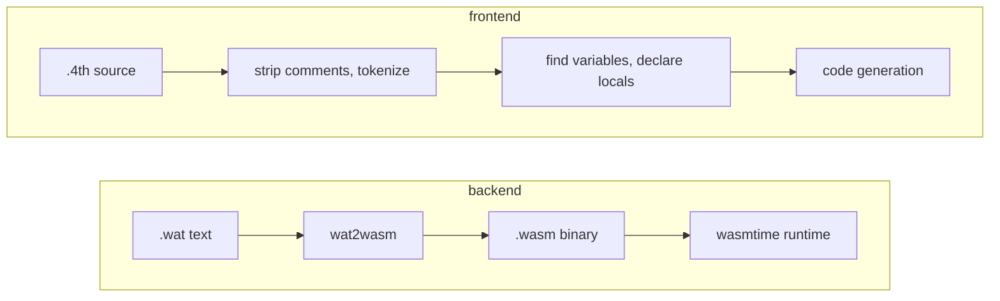

<div class="flex items-baseline justify-between mb-2">
  <h1 class="text-2xl font-light tracking-tight">Crafting your own compiler: from Python logic to high-speed WebAssembly</h1>
  <time class="text-sm text-gray-600 ml-4">July 14, 2026</time>
</div>

> *Notes from the EuroPython 2026 workshop on building a Forth-to-WebAssembly compiler in Python.*

## What is WebAssembly?

**[WebAssembly (Wasm)](https://webassembly.org)** is a binary instruction format for a **stack-based virtual machine**. There are no registers, every instruction pops its operands off the stack and pushes the result back on. For example, `i32.add` pops two values, and pushes their sum. Or similarly, `i32.le_s` (~ less or equal) pops two, pushes a boolean. Control flow (`block`, `loop`, `br`) works the same way: structured, nested regions instead of jumps to arbitrary addresses.

It's designed as a compiler target, not something you write by hand. **[Wasmtime](https://wasmtime.dev/)**, the runtime this workshop uses, runs `.wasm` binaries standalone from the command line (sandboxed).

## What is Forth?

**[Forth](https://en.wikipedia.org/wiki/Forth_(programming_language))** is written in **[Reverse Polish Notation (RPN)](https://en.wikipedia.org/wiki/Reverse_Polish_notation)**: operators come after their operands, `2 3 +` instead of `2 + 3`. Read left to right, every token is either a value to push or an operator to apply to what's already on the stack. The same order a stack machine executes in. That's why compiling RPN to Wasm feels almost natural: reading a `forth` program and reading its compiled `wasm` are nearly the same.

Adding two numbers:

```forth
1 2 +
```

```wat
i32.const 1
i32.const 2
i32.add
```

A comparison used as a loop condition, from one of the workshop's example programs:

```forth
i n <=
```

```wat
local.get $i
local.get $n
i32.le_s
```

Each RPN token becomes one Wasm instruction, in the same order.

## The pipeline

The compiler converts a `.4th` source file to a runnable `.wasm` binary:



The frontend's **code generation** output is the backend's `.wat` text input. **Tokenizing** and code generation are the mechanical step described above. Wasm needs every local **declared** before the function body can use it - Forth doesn't, you just write `x!` and `x` exists. So before generating any instructions, the compiler walks the whole program once to **collect** every variable name, then turns that list into the **declarations** that Wasm requires.

The full implementation is on **[GitHub](https://github.com/pyrsuit/europython2026)**, the workshop material is at **[arielortiz.info/europython2026](https://arielortiz.info/europython2026/)**.
