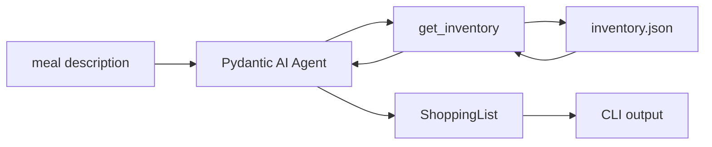

  <h1 class="text-2xl font-light tracking-tight">A meal planner with PydanticAI and Ollama</h1>
  <time class="text-sm text-gray-600 ml-4">June 14, 2026</time>

> *A CLI agent that turns meal descriptions into a categorized shopping list - running locally with [Ollama](https://ollama.com).*

## How it works

You describe what you want to cook in plain English. The agent checks what you already have at home and returns a structured, categorized shopping list with only the things you actually need to buy. It runs on your machine.

## The components

**[Pydantic AI](https://ai.pydantic.dev/)** is the agent framework. It handles the tool-calling loop, output validation, and retries. You define tools as plain Python functions decorated with [`@agent.tool`](https://ai.pydantic.dev/tools/) - the docstring becomes the tool description the LLM sees.

**Ollama** runs `llama3.2:3b` locally via a Docker container. `Pydantic AI` talks to it through the OpenAI-compatible `/v1` endpoint.

**`inventory.json`** is the single source of truth for what's at home. The agent gets it injected as [`deps`](https://ai.pydantic.dev/dependencies/) - `Pydantic AI`'s way of passing runtime data into tools without globals. You declare the type at agent construction time (`deps_type=dict`) and access it inside any tool via `ctx.deps`.

A `Pydantic` output model (`ShoppingList`) enforces structure on the LLM's response. If the model returns malformed JSON, `Pydantic AI` retries automatically up to 3 times before giving up.

If you want to run it yourself, the setup is in the [README](https://github.com/pyrsuit/shopping-agent).
